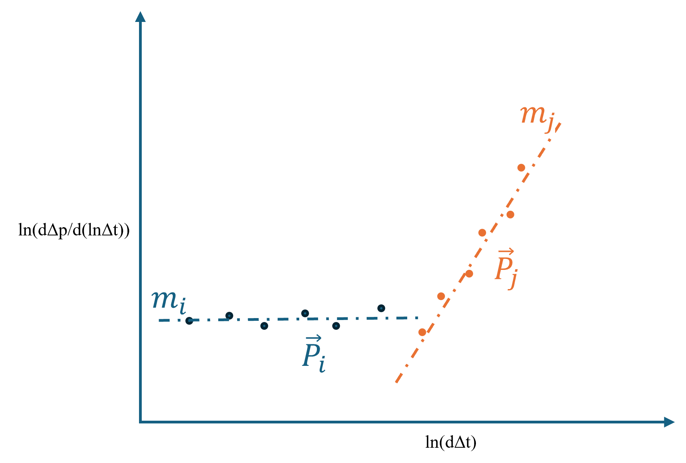

# Flow Regime Identification Using K-Means and K-Medoids Clustering

## Summary
This Python script identifies flow regimes present in a pressure transient diagnostic data. It applies both **K-Means** and **K-Medoids** clustering techniques, as well as semi-automated K-clustering using the Elbow method. It can reliably partition the diagnostic data into the different flow regimes by integrating various subject-specific diagnostic indicators. 
The program implements a sliding window approach to segment the pressure transient diagnostic data. Two standard partitioning techniques are utilized:
- **K-Means:** Applies Euclidean distance metric on segments, where each segment is characterized by a set of normalized mid-point (x, y) coordinates, along with slope and index information.
- **K-Medoids:** Applies a weighted composite pair-wise dissimilarity between segments, where is segment is characterized by Euclidean distance, angular difference, temporal and pattern information.

## Main Features

- **Composite-Metric Integration:** Combines several metrics, such as:
  - **Euclidean Distance:** Measures geometric differences.
  - **Angular Difference:** Computes differences in trends (slope) among segments.
  - **Temporal Penalty:** Disincentivizes cluster switching, especially on boundaries (i.e., prevents repeating clusters).
  - **Inverted-V Identification:** Recognizes a specific transient pattern which occurs in the early time region (ETR). This is an inverted-V, which indicates the strong wellbore storage on the left side of       the pattern and the weak wellbore storage on the right side of the pattern.
- **Semi-Automated Cluster Selection:** Applies the Elbow method, a heuristic technique, to find the most suitable number of clusters.
    
## Methodology

### Data Segmentation

The pressure diagnostic data is divided into segments by using a sliding window. Segment-by-segment analysis is more effective for flow regime identification because flow regimes are a cluster of data points (i.e., a segment). Segmentation also helps to reduce noise, making the analysis more credible.

### Feature Computation

For each segment, a set of features is extracted by computing a number of metrics as illustrated in Figure 1.


#### K-Means Clustering

Each segment is expressed as a set of normalized values consisting of:
  - **Mid-point \(x, y\) Coordinates:** The x and y coordinates, and median of all data points in the segment.
  - **Slope:** Derived using linear regression to determine the trend of the segment.
  - **Index Information:** The position of the segment within the dataset.
**Distance Calculation:** The set of normalized values are vertically stacked and used to compute a distance metric using the Euclidean norm. 

#### K-Medoids Clustering

A set of pairwise standardized dissimilarity measures are calculated between segments. These measures equate to various dimensions of the data:
- **Normalized Euclidean Distance**  
  For two 2D segments *P<sub>i</sub>* and *P<sub>j</sub>* each containing *m* data points:
  - Represent *P<sub>i</sub>* as:  
  
  - Represent *P<sub>j</sub>* as:  
  
     
   The normalized Euclidean distance <sub></sub> is computed as:

   ^2+(y_{ik}-y_{jk})^2\Bigr]})

   where *D<sub>E_max</sub>* is the maximum value in the Euclidean distance matrix.
- **Angular Dissimilarity**  
   For segments with at least two points, compute slopes *m₁* and *m₂* (via linear regression) for segments *P<sub>i</sub>* and *P<sub>j</sub>* respectively. The angular dissimilarity <sub></sub> is:

   )

- **Temporal Penalty**  
   Let δ (delta) be the absolute difference between the indices of segments *P<sub>i</sub>* and *P<sub>j</sub>*:

   For a dataset with *n* segments, define *T<sub>max</sub> = n - 1*. Then, the temporal penalty <sub></sub> is:
   If *T<sub>max</sub> > 0*:

  }{T_{max}})
  
  Otherwise:

  )

- **Inverted-V Identification**  
  When an inverted-V pattern is detected before a predefined cut-off (*early_time_index*), boolean labels <sub></sub> and <sub></sub> are set to True for the corresponding segments. The dissimilarity <sub>})</sub> is defined as:
  </sub> between segments *P<sub>i</sub>* and *P<sub>j</sub>* is computed as a weighted sum of the above metrics:

  )

  where the default hyperparameters are:
  , ,  and 


The max function ensures that the overall dissimilarity is non-negative.

### Clustering Techniques

- **K-Means Clustering:**  
  - **Representation:** Each segment is represented by a feature vector containing normalized mid-point coordinates, slope, and index information.
  - **Process:** The Euclidean distance between the feature vector and the cluster centroid is computed, segments are assigned to the nearest centroid, and centroids are updated iteratively until convergence.

- **K-Medoids Clustering:**  
  - **Representation:** Uses the composite dissimilarity measure <sub></sub> computed from Euclidean, angular, temporal, and inverted-V metrics.
  - **Process:** Selects actual data segments (medoids) as cluster centers and forms clusters based on the weighted aggregation of these dissimilarities.

- **Semi-Automated K-Clustering with the Elbow Method:**  
  - **Process:** Computes the within-cluster sum-of-squares (WCSS) for various \(K\) values, generates an Elbow plot to indicate where WCSS reduction plateaus, and recommends an optimal \(K\) while allowing manual adjustments.

## Installation and Requirements

### Requirements
- **Python 3.x**
- Required packages:
  - `numpy`
  - `scipy`
  - `scikit-learn`
  - `pandas`
  - `matplotlib` (for visualization)

### Installation

Clone the repository and install dependencies:

```bash
git clone https://github.com/molokwuvictor/Semi-Automated_K-Clustering.git
cd your-repo
pip install -r requirements.txt
